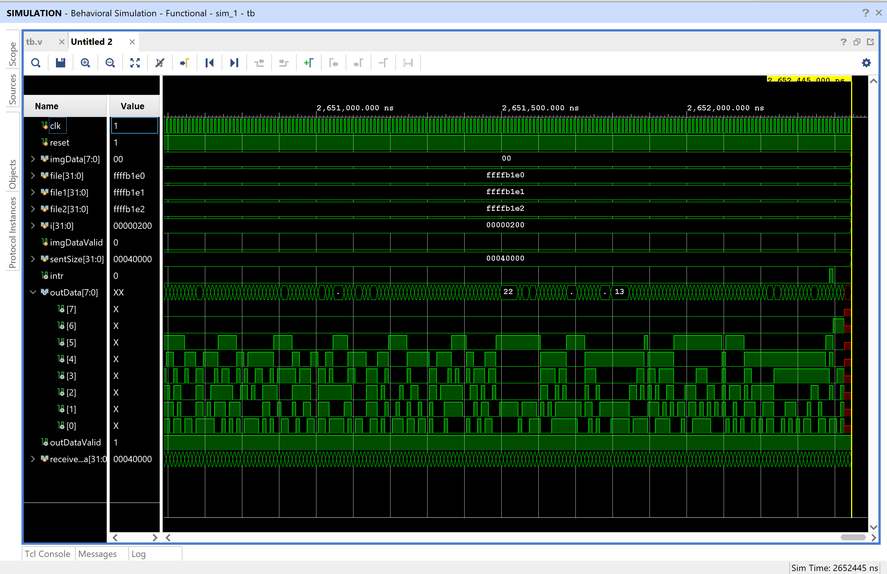
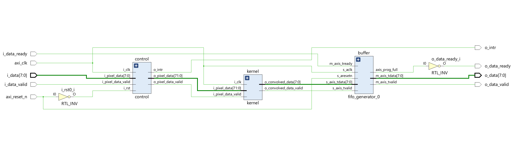
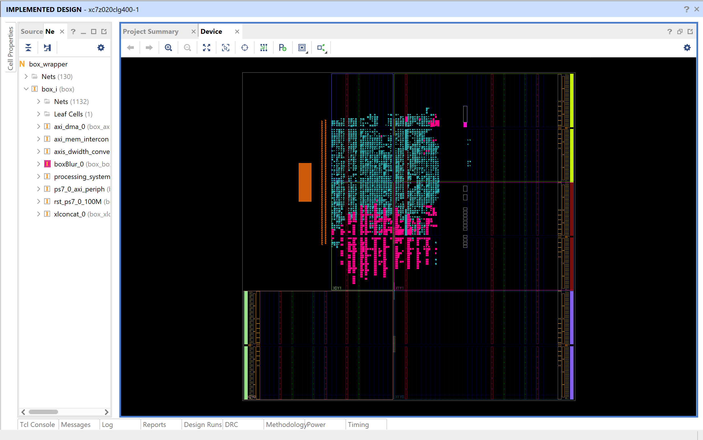

# Phase 2 Iteration Report: Hardware IP for Box Blur (3×3 Kernel)

## Design Overview
This hardware IP implements a pipelined image processing pipeline that:
- Buffers incoming pixel data row-wise,
- Generates 3×3 pixel windows for convolution, and
- Applies a 3×3 averaging (box blur) filter using streaming dataflow.

### Image Format
- **Resolution**: 512 × 512 pixels  
- **Format**: Grayscale (8-bit)  
- **Kernel**: Fixed 3×3 Box Blur  
- **I/O Interface**: AXI-Stream  

---

## Module Architecture

### Line Buffer

**Purpose**:  
Stores one line (512 pixels) of grayscale image data and outputs 3 consecutive pixels to form a horizontal strip for convolution.

**Key Features**:
- 512-entry memory (`line[511:0]`)
- Outputs 3 adjacent pixels (24-bit total)
- Controlled by write and read pointers
- **Inputs**: Clock, Reset, 8-bit Pixel Input, Valid, Read Enable  
- **Outputs**: 3 × 8-bit Pixels

---

### Controller

**Purpose**:  
Controls writing to and reading from four line buffer instances and assembles 3×3 sliding windows from the pixel stream.

**Functionality**:
- Uses 4 circular line buffers (lB0 to lB3)
- Tracks pixel and row indices
- Assembles 3×3 pixel windows (72-bit)
- Controls data flow via FSM
- Issues interrupt when full image is processed

**Key Signals**:
- `pixelCounter`, `currentWrLineBuffer`, `lineBuffDataValid`
- `currentRdLineBuffer`, `rd_line_buffer`
- `o_intr` interrupt output

---

### Kernel

**Purpose**:  
Applies a 3×3 convolution using a fixed kernel with all weights equal to 1 (i.e., a box blur).

**Operation**:
- Input: 72-bit window (9 pixels × 8 bits)
- Multiply each pixel by 1
- Sum and divide by 9 to compute average
- Output: 8-bit result
- Implemented with 2-cycle latency (multiply → sum/output)

---

### boxBlur (Top-Level Wrapper)

**Purpose**:  
Top-level module integrating controller, kernel, and streaming interfaces.

**Interfaces**:
- **AXI-Stream Slave**: Input pixel stream  
- **AXI-Stream Master**: Output processed pixel stream  
- **Interrupt**: `o_intr` raised after processing image  

**Behavior**:
- Buffers input stream
- Forms sliding 3×3 windows
- Filters through convolution kernel
- Outputs processed pixels via AXI
- Manages backpressure using `axis_prog_full`

---

## System Pipeline Summary

1. Pixels arrive via AXI-Stream.
2. Buffered line-by-line into circular line buffers.
3. Controller assembles 3×3 sliding windows.
4. Kernel performs 3×3 averaging convolution.
5. Output stream is produced in real-time.
6. Interrupt (`o_intr`) is triggered after full image is processed.

---

## Performance and Validation

The design was tested using a custom Verilog testbench.

- **Image Size**: 512 × 512 pixels (grayscale)
- **Kernel**: Fixed 3×3 box blur
- **Simulation Time**:  
  The full image was processed in approximately **~2.52 milliseconds**.

### Testbench Simulation Waveform
Shows the timing and data flow of pixel buffering and convolution through the system pipeline.

---

### Synthesized Schematic
Top-level synthesized schematic of the `boxBlur` IP, illustrating the connectivity between controller, kernel, and AXI interfaces.

---

### Implementation Design in Zynq
Device layout post-implementation on the PYNQ-Z1 target, showing placement of IP and routing.

---

## Deployment Status

- The IP core was successfully packaged and integrated into a Vivado block design.
- The bitstream was generated and targeted for the **PYNQ-Z1** board.
- However, we encountered issues creating a working PYNQ overlay from the design. As a result, the IP has not yet been verified in hardware using the PYNQ Python environment.

---

## Summary

This phase successfully delivered a custom image processing IP that:
- Buffers and streams pixel data,
- Assembles 3×3 windows in hardware,
- Applies a box blur (average filter), and
- Outputs filtered pixels through AXI-Stream.

Despite completion of the IP packaging and bitstream generation, full system validation on PYNQ is pending due to overlay integration issues.

