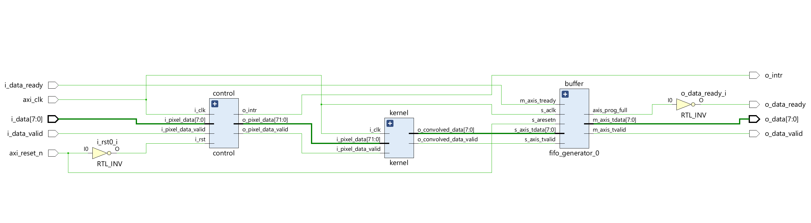
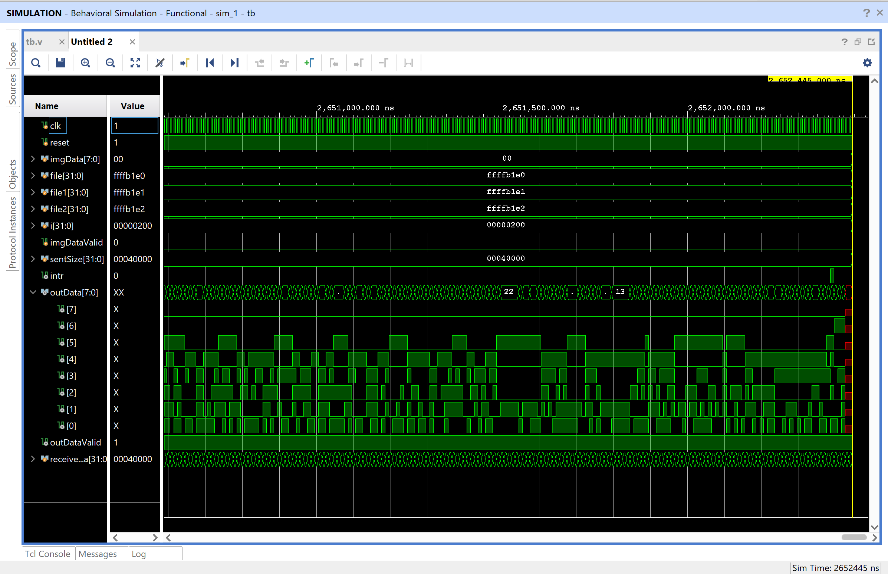
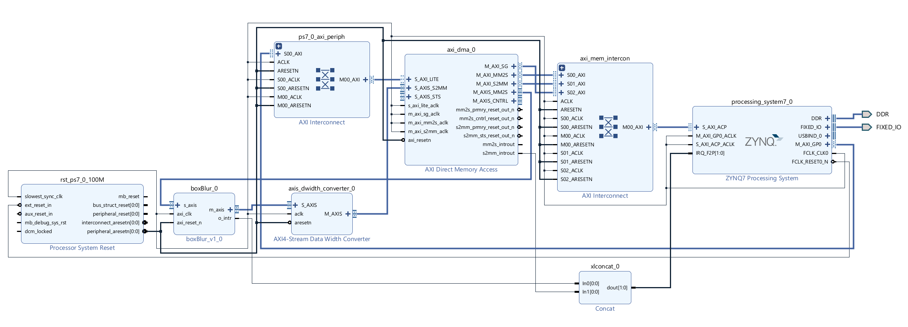
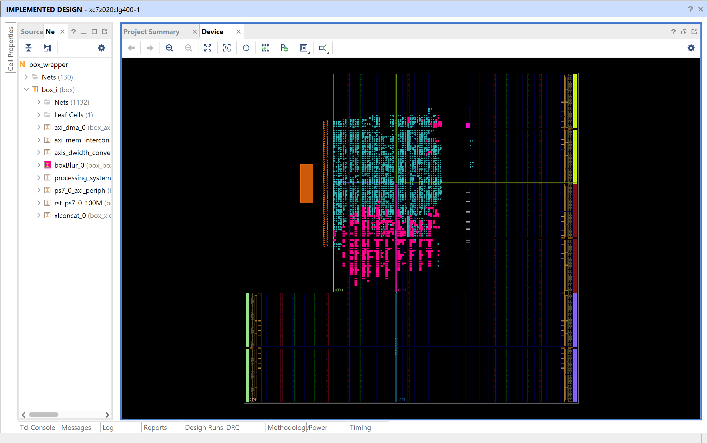
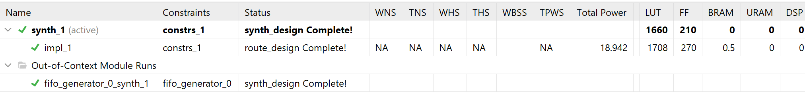
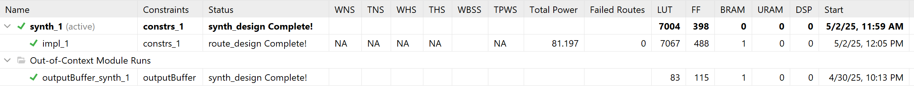
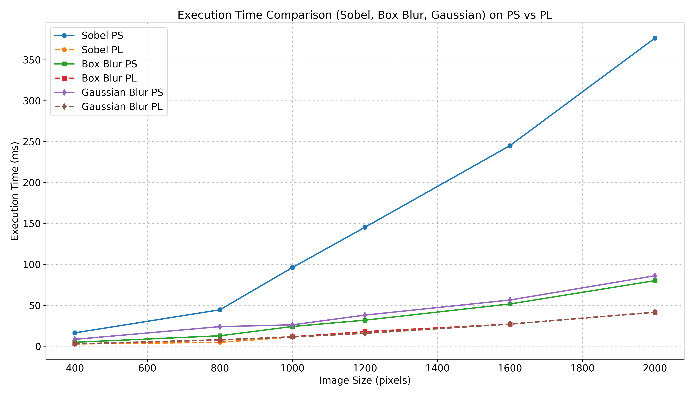

# Final Report: Image Processing on FPGA
[Link to the Presentation File](https://drive.google.com/file/d/1RSJ4zUEbG3CQAAyqpU0TgafpjWqgjzlL/view?usp=sharing)

## Team Members:
- Rithani Priyanga Coimbatore Kannan (hwu6hc)
- Vishnuvartthan Govindaraj (fpp6vt) 

## Description
The goal of this project is to implement computationally intensive digital image filters on an FPGA platform to achieve real-time image processing. Processing images in real-time can be computationally expensive, especially when applying complex filters to high-resolution images. Software-based solutions struggle with the latency and processing time required for live image analysis, making hardware acceleration through FPGAs more effective. By accelerating the image filtering process on FPGA hardware, we aim to significantly improve processing time, enabling real-time applications such as video stream processing, edge detection for vision systems, and preprocessing stages for AI-based systems. The FPGA's parallel processing capability will allow for faster data manipulation than general-purpose processors, making it suitable for high-speed image processing tasks.

## Overview
This project involved the development of a custom image processing hardware IP targeting FPGA-based acceleration on the PYNQ platform. The initial implementation delivered a streaming box blur filter using a **3×3 kernel** for **grayscale images** (8-bit per pixel), supporting real-time processing via AXI-Stream interfaces. In the final phase, this design was scaled to support a **7×7 kernel** and **24-bit color images**, enabling the IP to image processing on relatively higher-resolution inputs (up to 1024×1024 pixels).

## 3×3 Box Blur IP
## Module Architecture
The **3×3 box blur IP** was designed around a pipelined streaming architecture with three main modules:

### **Input Line Buffers**:
Store rows of incoming pixel data. Three consecutive rows are buffered using circular line buffers to enable 3×3 window formation at each clock cycle.

**Key Features**:
- 512-entry memory (`line[511:0]`)
- Outputs 3 adjacent pixels (24-bit total)
- Controlled by write and read pointers
- **Inputs**: Clock, Reset, 8-bit Pixel Input, Valid, Read Enable  
- **Outputs**: 3 × 8-bit Pixels


### **Buffer Controller**: 
A finite state machine orchestrates read/write operations from the buffers, assembles 3×3 pixel windows, and ensures valid data is passed to the kernel in a streaming fashion.

**Functionality**:
- Uses 4 circular line buffers (lB0 to lB3)
- Tracks pixel and row indices
- Assembles 3×3 pixel windows (72-bit)
- Controls data flow via FSM
- Issues interrupt when full image is processed

**Key Signals**:
- `pixelCounter`, `currentWrLineBuffer`, `lineBuffDataValid`
- `currentRdLineBuffer`, `rd_line_buffer`
- `o_intr` interrupt output

### Kernel:
Performs the averaging filter operation over a 3×3 window by summing pixel values and dividing the result by 9. The kernel has a fixed latency of 2 cycles and operates in a fully pipelined manner.

**Operation**:
- Input: 72-bit window (9 pixels × 8 bits)
- Multiply each pixel by 1
- Sum and divide by 9 to compute average
- Output: 8-bit result
- Implemented with 2-cycle latency (multiply → sum/output)

Synthesized Schematic of the 3x3 IP block


The module was verified using a custom Verilog testbench, demonstrating efficient processing of a 512×512 grayscale image in approximately **2.65 milliseconds**. 



The IP was packaged and integrated into a Vivado block design targeting the PYNQ-Z1 board.






## 7×7 Box Blur IP
To extend functionality, we developed a 7×7 box blur IP that supports **24-bit RGB images** and higher resolutions (up to **1024×1024**). Enhancements include:

- Support for larger kernel size and deeper window generation logic.
- Expanded buffer management to handle increased data bandwidth; 8 line buffers are instantiated and information from 7 buffers are fetched in a circular fashion.
- Color image compatibility with 24-bit pixel width.

Both **3×3** and **7×7** kernels are now implemented as separate IP blocks, packaged and bitstream-ready. However, more optimization is required for the design to improve synthesis performance and resource usage. Below are the LUT and Flip-flops utilization for both 3x3 and 7x7 designs.

Utilization overview of 3x3 IP


Utilization overview of 7x7 IP



## Compatibility and Comparison with Existing Overlays

We have implemented our IPs with Zynq Processing System and generated bistream out of it, but we weren't able to use them in the Jupyter notebook in Pynq Z1 board, as our IPs are currently not compatible with OpenCV’s Python interface, and making direct comparison with OpenCV APIs unsuitable. Instead, we explored and benchmarked an existing overlay: `xv2Filter2DDilate.bit` from the [PYNQ ComputerVision repository](https://github.com/Xilinx/PYNQ-ComputerVision).

### xfOpenCV Pynq Overlays:

- This overlay supports only 3×3 kernels for filters like **Box**, **Gaussian**, **Sobel** and more.
- Regardless of the filter type, the execution time remains nearly identical due to floating-point operations for every pixel.
- The overlay is flexible but **limited to 3×3 kernels** and does not allow customization for larger filters.
- All the Jupyter Notebooks are uploaded in the repository.

## Code Walkthrough: Using `xv2Filter2DDilate` Overlay with PYNQ
This example demonstrates how to use a hardware-accelerated 2D filter on the PYNQ platform using the `xv2Filter2DDilate` overlay from the `pynq_cv` package. It includes loading an image, allocating memory, applying the filter using a kernel, and storing the output.


```python
from pynq import Overlay, Xlnk
import pynq_cv.overlays.xv2Filter2DDilate as xv2
import numpy as np
import cv2
```
Imports the Overlay class to load FPGA bitstreams and Xlnk for memory allocation.

```python
ol = Overlay("/usr/local/lib/python3.6/dist-packages/pynq_cv/overlays/xv2Filter2DDilate.bit")
Xlnk.set_allocator_library("/usr/local/lib/python3.6/dist-packages/pynq_cv/overlays/xv2Filter2DDilate.so")
mem_manager = Xlnk()
```
Loads the xv2Filter2DDilate FPGA overlay bitstream to the programmable logic.
Specifies the shared object (.so) file used for memory allocation compatible with this overlay.

```python
mem_manager = Xlnk()
```

Creates an instance of the Xlnk memory manager to allocate memory in the CMA (Contiguous Memory Allocator) region. However, this is deprecated, and so use pynq.allocate(shape, dtype) in newer versions of PYNQ (v2.7+).

```python
image = cv2.imread("bellatrix.jpg", cv2.IMREAD_GRAYSCALE)
xFimg = mem_manager.cma_array((h, w), np.uint8)
xFimg[:] = scaled_image[:]
xFout = mem_manager.cma_array((h, w), np.uint8)
```
Allocates FPGA-accessible memory (CMA buffer) for the input image of size (h, w) with 8-bit unsigned integers.
Copies the image (e.g., scaled_image) into the input buffer xFimg. 
Allocates another CMA buffer for the output image, same shape and type.

Alternatively, using pynq.allocate for CMA,

```python
xFimg = allocate(shape=(height, width), dtype=np.uint8)
xFout = allocate(shape=(height, width), dtype=np.uint8)

xFimg[:] = image[:]
xFimg.flush()
```

For Video with HDMI in and out,
```python
from pynq.lib.video import *ode
hdmi_in.configure(PIXEL_GRAY)
hdmi_out.configure(hdmi_in.mode)

hdmi_in.cacheable_frames = False
hdmi_out.cacheable_frames = False

hdmi_in.start()
hdmi_out.start()

```


#### Filter Kernel

Box Blur Kernel: Uniform average filter over a 3×3 region.
```python
kernel = np.ones((3,3),np.float32)/9.0
```

Gaussian Blur Kernel for smoothing the image.
```python
kernel = np.array([[1.0,0.0,-1.0],[2.0,0.0,-2.0],[1.0,0.0,-1.0]],np.float32)
```

Sobel Kernel used for edge detection (horizontal gradient).
```python
kernel = np.array([[0.0625,0.125,0.0625],[0.125,0.25,0.125],[0.0625,0.125,0.0625]],np.float32)
```

#### Hardware-Accelerated Filtering

```python
xv2.filter2D(xFimg, -1, kernel, dst=xFout, borderType=cv2.BORDER_CONSTANT)
```

Below code is uses input from HDMI for 500 frames
```python
for _ in range(500):
        outframe = hdmi_out.newframe()
        inframe = hdmi_in.readframe()
        xv2.filter2D(inframe, -1, kernel_g, dst=outframe, borderType=cv2.BORDER_CONSTANT)
        hdmi_out.writeframe(outframe)
        inframe.freebuffer()
```

#### Displaying the processed Image
```python
import PIL.Image

image = PIL.Image.fromarray(xFout)
image
```

#### Filter execution time comparison




## Building a Custom xfOpenCV Overlay

To support custom filters like our **7×7 box blur**, we explored building a user-defined overlay using `xfOpenCV` and `SDx` cross-compilation tools.


### Prerequisites

1. **Clone the PYNQ Computer Vision Repository**:
   ```commandline
   git clone https://github.com/Xilinx/PYNQ-ComputerVision.git <your_pynqcv_folder>
   ```

2. **Clone the xfOpenCV Repository**:
   ```commandline
   git clone https://github.com/denolf/xfopencv.git <your_xfopencv_folder>
   cd <your_xfopencv_folder>
   git checkout <release_number>
   ```
3. **Prepare Platform Package:**:
- Download the platform sysroot archive and untar it.

4. **Set Environment Variables:**:
   ```commandline
   setenv XFOPENCV_PATH <your_xfopencv_folder>
   ```

5. **Source the Xilinx SDx Tools:**:
- Use the SDx 2018.3 setup script.


## [Building a Custom xfOpenCV Overlay](https://github.com/Xilinx/PYNQ-ComputerVision/blob/master/overlays/README.md#building-your-overlay)
  + create an overlay folder in /<your_pynqcv_folder>/overlays, for instance myFirstOverlay
  + Copy and adapt the [/<your_pynqcv_folder>/overlays/cvXfUserSpecific/CMakeLists.txt](./cvXfUserSpecific/CMakeLists.txt) to /<your_pynqcv_folder>/overlays/myFirstOverlay
    + line 41, choose your overlay name, for instance xv2MyFirstOverlay
    + line 45, choose the CV components offloaded to PL in your overlay, restricted to a subset of filter2D, remap, dilate, stereoBM and canny
    + lines 47-49: optionally overwrite some of the default instantiation paramaters (defined in the [setDefaultInstantiationParameters CMake macro](../frameworks/cmakeModules/rulesForSDxXfOpenCV.cmake#L37)) by user specific ones 
  + create a build folder in /<your_pynqcv_folder>/overlays/myFirstOverlay run CMake:
    ```commandline
    $ cd /<your_pynqcv_folder>/overlays/myFirstOverlay
    $ mkdir build; cd build
    $ cmake .. -DCMAKE_TOOLCHAIN_FILE=../../../frameworks/cmakeModules/cmakeModulesXilinx/toolchain_sds.cmake -DSDxPlatform=/your_PynqPlatform_folder/ultra -DSDxClockID=1 -DusePL=ON -DnoBitstream=OFF -DnoSDCardImage=ON -DSDxArch=arm64
    ```
  + Note that the clock ID for the platform selects the desired clock frequency for the overlay design. In the case of the Ultra96 platform, the following IDs are available: 0=100MHz, 1=150MHz, 2=250MHz, 3=300MHz.
  + run make for the target with your chosen overlay name
    ```commandline
    $ make xv2MyFirstOverlay
    ```
  + run make install. This will copy three files (xv2MyFirstOverlay.tcl, xv2MyFirstOverlay.so, xv2MyFirstOverlay.bit) to /<your_pynqcv_folder>/overlays/myFirstOverlay/libarm64 
    ```commandline
    $ make install
    ```
  + copy the content of /<your_pynqcv_folder>/overlays/myFirstOverlay/build/libarm64 to a test folder (for instance ~/proj/test) on your pynq board:
    ```commandline
    $  scp xv2MyFirstOverlay.* xilinx@<pynq-board-ip>:/home/xilinx/proj/test
    ```


## Technology Stack:
- Software: Xilinx Vivado, Jupyter Notebook
- Hardware Platform: Xilinx Pynq-Z1 FPGA 
- Languages: Verilog
- Software Tools: Xilinx Vivado, Vitis-HLS
- Peripheral Interfaces: Camera Module, HDMI, Display


## Conclusion

This project delivered a scalable image filtering IP architecture that supports both **3×3** and **7×7 box blur filters** using a fully pipelined hardware implementation. The 3×3 design operates on 8-bit grayscale images, while the 7×7 version extends support to **24-bit color images** and larger resolutions up to **1024×1024 pixels**. Both IPs use AXI-Stream interfaces for high-throughput data transfer and are packaged as reusable IP cores in Vivado. We implemented the design for Pynq Z1 board, and generated the bitstream, but we weren't able to use the bit overlay in the jupyter notebook. While these IPs are not yet compatible with OpenCV’s high-level APIs, a comparison with an existing PYNQ overlay (`xv2Filter2DDilate.bit`) showed significant performance gains when using hardware acceleration. However, that overlay supports only 3×3 kernels for a fixed set.  However, we are looking forward to develop compatible custom overlays for the OpenCV libraries, that will be specific to kernel types and flexible in terms of choosing the size of the filter kernel. 


## References

- https://github.com/Xilinx/PYNQ-ComputerVision Official repository providing PYNQ overlays and examples for hardware-accelerated computer vision applications.
- https://github.com/Xilinx/xfopencv A library of OpenCV-like functions optimized for Xilinx FPGAs. Used to build high-performance image processing pipelines.
- https://github.com/vipinkmenon/SpatialFilter
  A repository demonstrating spatial filter design and implementation for image processing using custom hardware.


